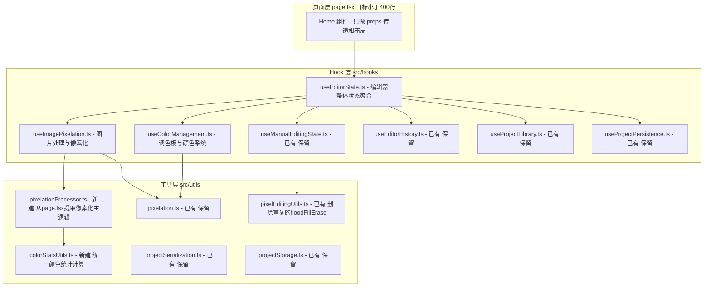

## 代码结构分析与重构计划

---

### 现状问题总结

通过完整分析，`src/app/page.tsx` 存在以下明显问题：

| 问题 | 描述 |
|------|------|
| 文件过大 | 2645 行，包含 40+ 个 `useState`、多个 `useEffect`、10+ 个 `useMemo/useCallback`、核心算法逻辑 |
| 职责混乱 | 同时承担：文件处理、像素化算法、颜色管理、项目存储、UI 交互、下载逻辑 |
| 逻辑重复 | `floodFillErase`（第 1451 行）在 `page.tsx` 中与 `pixelEditingUtils.ts` 重复定义；颜色统计计算逻辑出现 3 次以上 |
| Hook 未整合 | 已有 `useManualEditingState.ts` 和 `usePixelEditingOperations.ts`，但 `page.tsx` 仍直接操作这些状态 |
| 像素化主函数 | `pixelateImage` 函数（第 868-1116 行）约 250 行，承担图片加载、颜色映射、颜色合并、状态更新，不适合放在组件内 |
| 两个相同 Effect | 第 392 行和第 489 行都在监听调色板变化更新 `activeBeadPalette`，存在重复 |

---

### 重构目标

**不改变功能**，仅改善代码结构：
1. `page.tsx` 缩减至 400 行以内（纯渲染层）
2. 业务逻辑全部收入专用 Hook
3. 核心算法与工具函数统一归入 `utils/`
4. 消除重复代码

---

### 重构架构设计

---

### 具体重构步骤（按优先级排序）

#### 阶段一：提取工具函数（低风险，高收益）

**步骤 1** — 新建 `src/utils/colorStatsUtils.ts`
- 将以下重复逻辑提取为统一函数：
  - `page.tsx` 第 239-251 行（`applyPixelDataChange` 内部统计）
  - `page.tsx` 第 286-295 行（`syncPixelDataWithoutHistory` 内部统计）
  - `page.tsx` 第 1071-1083 行（`pixelateImage` 内部统计）
  - `page.tsx` 第 678-695 行（CSV 导入统计）
  - `pixelEditingUtils.ts` 中已有的 `recalculateColorStats`
- 统一为一个 `recalculateColorStats(pixelData)` 函数（已有的保留并扩展）

**步骤 2** — 新建 `src/utils/pixelationProcessor.ts`
- 将 `page.tsx` 中的 `pixelateImage` 函数（第 868-1116 行）完整提取
- 输入：`{ imageSrc, granularity, similarityThreshold, palette, mode }`
- 输出：`{ mappedPixelData, gridDimensions, colorCounts, totalBeadCount }`
- 纯函数，不依赖 React 状态

**步骤 3** — 删除 `page.tsx` 第 1451 行的 `floodFillErase` 重复定义
- 改为直接引用 `pixelEditingUtils.ts` 中的导出函数

#### 阶段二：新建 Hooks（中风险）

**步骤 4** — 新建 `src/hooks/useImagePixelation.ts`
- 封装：`originalImageSrc`、`granularity`、`similarityThreshold`、`pixelationMode`、`remapTrigger`
- 封装图片处理流程（调用 `pixelationProcessor.ts`）
- 向上暴露：`processFile`、`handleConfirmParameters`、`handlePixelationModeChange`、`pixelatedResult`

**步骤 5** — 新建 `src/hooks/useColorManagement.ts`
- 封装：`activeBeadPalette`、`customPaletteSelections`、`excludedColorKeys`、`isCustomPalette`、`selectedColorSystem`
- 封装：`handleToggleExcludeColor`、`handleSelectionChange`、`handleSaveCustomPalette`、`handleApplyPalettePreset`、`handleImportPaletteFile`、`handleExportCustomPalette`
- 合并两个重复的 `activeBeadPalette` 更新 Effect（第 392 行和第 489 行）

**步骤 6** — 修改 `page.tsx`，整合以上 Hooks
- 删除已被 Hook 封装的状态和函数
- 保留纯粹的 JSX 渲染部分

#### 阶段三：整理 page.tsx 渲染结构（低风险）

**步骤 7** — 清理 `page.tsx` 中的冗余注释和 console.log
- 约 50+ 处 `console.log`，仅保留关键错误日志

---

### 文件变更概览

| 文件路径 | 操作 | 说明 |
|----------|------|------|
| `src/utils/colorStatsUtils.ts` | 新建 | 统一颜色统计逻辑 |
| `src/utils/pixelationProcessor.ts` | 新建 | 提取像素化处理主逻辑 |
| `src/hooks/useImagePixelation.ts` | 新建 | 图片处理 Hook |
| `src/hooks/useColorManagement.ts` | 新建 | 颜色管理 Hook |
| `src/app/page.tsx` | 大幅精简 | 从 2645 行缩减至约 400 行 |
| `src/utils/pixelEditingUtils.ts` | 微调 | 删除 `page.tsx` 中的重复定义引用 |

---

### 不改动的文件

- `src/hooks/useEditorHistory.ts` ✅ 已经很干净
- `src/hooks/useProjectLibrary.ts` ✅ 已经很干净
- `src/hooks/useProjectPersistence.ts` ✅ 已经很干净
- `src/hooks/useManualEditingState.ts` ✅ 已经很干净
- `src/hooks/usePixelEditingOperations.ts` ✅ 已经很干净
- `src/utils/projectStorage.ts` ✅ 已经很干净
- `src/types/` ✅ 类型定义无需变更
- `src/components/` ✅ 组件层无需变更
- `src/app/focus/page.tsx` ✅ 不在本次范围

---

**你是否认可这份重构计划？如果认可，我会切换到 Code 模式按步骤实施。**