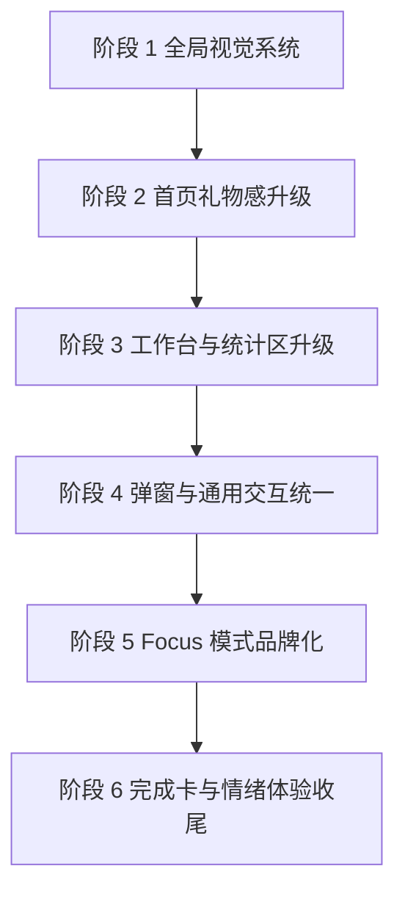

# 婷婷的拼豆工坊可执行改造清单

## 1. 实施目标

在不改动核心拼豆业务能力的前提下，把现有站点升级成一个：
- 温柔高级
- 粉白奶油风统一
- 更像私人礼物站而不是普通工具站
- 更专业、更有品牌感、更适合长期使用和展示

核心原则：
1. 先统一设计语言，再重做页面包装
2. 先改首页和共用样式，再改 focus 模式
3. 先做低风险视觉重构，不先动复杂业务逻辑
4. 文案、层级、交互反馈必须一起升级，不能只换颜色

---

## 2. 执行顺序总览

---

## 3. 可执行 Todo

### 阶段 1：建立全局奶油粉视觉系统

目标：让所有页面先拥有统一的色彩、圆角、边框、阴影、背景和按钮语言。

#### 1.1 重构全局设计 token
- 主要文件：[`src/app/globals.css`](src/app/globals.css:1)
- 改造内容：
  - 新增品牌色变量、语义背景色、文字色、描边色
  - 定义统一阴影 token
  - 定义统一圆角 token
  - 定义玻璃感卡片背景 token
  - 定义柔和渐变背景 token
- 验收标准：
  - 页面不再依赖零散的主色写法作为视觉基础
  - 后续组件可直接消费统一 token

#### 1.2 统一全站基础背景与字体层级
- 主要文件：[`src/app/layout.tsx`](src/app/layout.tsx:1)
- 配套文件：[`src/app/globals.css`](src/app/globals.css:1)
- 改造内容：
  - 调整全站 body 背景为奶油白渐变体系
  - 统一主字体与标题字体的使用规则
  - 定义基础排版层级，例如页面标题、模块标题、说明文案
- 验收标准：
  - 首页和 focus 页面进入时都能感受到同一品牌氛围

#### 1.3 建立通用 UI 样式基座
- 主要文件：[`src/app/globals.css`](src/app/globals.css:1)
- 改造内容：
  - 抽离通用按钮样式类
  - 抽离通用卡片样式类
  - 抽离输入框和 select 样式类
  - 抽离弹窗容器和遮罩样式类
- 验收标准：
  - 后续组件改造时尽量复用 class 体系，而不是继续局部堆 Tailwind

---

### 阶段 2：首页礼物感品牌升级

目标：把首页从功能页升级成更有记忆点的私人礼物站首页。

#### 2.1 升级顶部品牌头图
- 主要文件：[`src/components/home/HomeHeroHeader.tsx`](src/components/home/HomeHeroHeader.tsx:1)
- 改造内容：
  - 强化品牌标题、副标题、标签区层次
  - 增加更完整的礼物感文案
  - 增加视觉陪衬元素，例如预览卡、漂浮珠粒、柔光装饰
  - 增加明确 CTA 区
- 验收标准：
  - Hero 区一打开就能体现私人小站、礼物感、品牌感

#### 2.2 重做上传入口卡
- 主要文件：[`src/app/page.tsx`](src/app/page.tsx:1042)
- 改造内容：
  - 把拖拽上传区域包装成欢迎入口卡
  - 增加步骤引导和推荐图片提示
  - 优化空状态文案语气，降低工具提示感
  - 增加 hover 与可点击反馈的一致性
- 验收标准：
  - 没上传图片时也显得完整好看，不空不硬

#### 2.3 重做首页信息提示卡
- 主要文件：[`src/app/page.tsx`](src/app/page.tsx:1064)
- 改造内容：
  - 将小贴士卡改成品牌语气提示卡
  - 调整图标、背景、边框和字色层级
  - 让提示不再像系统通知，而像温柔引导
- 验收标准：
  - 首页辅助信息不破坏整体高级感

---

### 阶段 3：把核心工作区做成专业工作台

目标：让参数、预览、统计、入口操作形成统一的工作台体验。

#### 3.1 升级参数控制面板
- 主要文件：[`src/components/home/HomeControlsPanel.tsx`](src/components/home/HomeControlsPanel.tsx:1)
- 改造内容：
  - 把当前表单改成分组式卡片布局
  - 提升标签说明、输入框、按钮、色板选择的视觉质量
  - 强化主次操作层级，例如应用参数、自动抠图、自定义色板
  - 统一输入区的圆角、阴影、hover、focus 样式
- 验收标准：
  - 面板看起来像精品创作工具，而不是普通后台表单

#### 3.2 升级预览工作台容器
- 主要文件：[`src/app/page.tsx`](src/app/page.tsx:1114)
- 相关组件：[`src/components/PixelatedPreviewCanvas.tsx`](src/components/PixelatedPreviewCanvas.tsx:1)
- 改造内容：
  - 增加预览头部摘要栏，例如尺寸、色数、难度
  - 优化预览背景底板
  - 增强工作台外层容器层级
  - 将主操作按钮组织成更清晰的 CTA 区
- 验收标准：
  - 预览区成为页面视觉中心

#### 3.3 升级难度与统计摘要卡
- 主要文件：[`src/app/page.tsx`](src/app/page.tsx:1175)
- 改造内容：
  - 把现有三列摘要改成更精致的数据卡
  - 提升层级、留白和标签说明
  - 让难度信息更像作品概览，而不是技术数据
- 验收标准：
  - 数据摘要更清晰，也更有展示感

#### 3.4 升级色号统计区
- 主要文件：[`src/app/page.tsx`](src/app/page.tsx:1193)
- 改造内容：
  - 重构列表视觉，改成作品配方卡风格
  - 优化排除颜色、恢复颜色的交互反馈
  - 弱化高饱和警告红，统一到品牌体系
  - 优化列表头部信息层次
- 验收标准：
  - 色号统计可读性更高，且整体风格统一

#### 3.5 升级主操作按钮区
- 主要文件：[`src/app/page.tsx`](src/app/page.tsx:1335)
- 改造内容：
  - 统一手动编辑模式、focus 模式、下载等按钮样式
  - 明确主按钮、次按钮、辅助按钮的层级
  - 文案改成更温柔但不幼稚的品牌语气
- 验收标准：
  - 所有重要动作都清晰且高级

---

### 阶段 4：统一弹窗和悬浮交互体系

目标：清理当前零散组件样式，让全站弹窗和悬浮操作都属于同一设计体系。

#### 4.1 升级下载设置弹窗
- 主要文件：[`src/components/DownloadSettingsModal.tsx`](src/components/DownloadSettingsModal.tsx:1)
- 改造内容：
  - 重做弹窗结构、表单样式、开关样式、按钮样式
  - 统一遮罩、模糊、圆角、标题区设计
  - 增加更细腻的保存与下载操作反馈
- 验收标准：
  - 下载设置弹窗与首页视觉风格一致

#### 4.2 统一自定义色板弹窗外壳
- 主要文件：[`src/components/home/HomePaletteModal.tsx`](src/components/home/HomePaletteModal.tsx:1)
- 相关组件：[`src/components/CustomPaletteEditor.tsx`](src/components/CustomPaletteEditor.tsx:1)
- 改造内容：
  - 重做 modal 外壳风格
  - 优化色板编辑器在新风格下的标题、容器、操作区
  - 保持业务逻辑不变，仅调整包装与层级
- 验收标准：
  - 色板编辑过程不再有风格割裂感

#### 4.3 统一悬浮操作组件样式
- 主要文件：[`src/components/FloatingToolbar.tsx`](src/components/FloatingToolbar.tsx:1)
- 改造内容：
  - 升级成奶油玻璃感悬浮工具条
  - 统一图标尺寸、激活态、禁用态、阴影
  - 强化在 focus 和手动编辑模式中的品牌延续
- 验收标准：
  - 悬浮工具不再像独立旧组件

---

### 阶段 5：Focus 模式品牌化升级

目标：把 focus 模式做成这个网站最有记忆点的沉浸式功能。

#### 5.1 重做 focus 页面整体视觉框架
- 主要文件：[`src/app/focus/page.tsx`](src/app/focus/page.tsx:1)
- 改造内容：
  - 统一背景层、顶部信息层、侧边或底部操作层风格
  - 改善页面留白、结构层级和沉浸感
  - 让它和首页属于同一品牌系统
- 验收标准：
  - focus 页面切换后仍然保持奶油粉礼物系品牌感

#### 5.2 升级颜色面板
- 主要文件：[`src/components/ColorPanel.tsx`](src/components/ColorPanel.tsx:1)
- 改造内容：
  - 重做搜索框、排序区、颜色项布局
  - 提升底部抽屉面板高级感
  - 增加颜色项状态层级，例如当前选中、完成度、剩余量
- 验收标准：
  - 色板面板既专业又精致

#### 5.3 升级进度与工具栏相关面板
- 主要文件：[`src/components/ProgressBar.tsx`](src/components/ProgressBar.tsx:1)
- 相关组件：[`src/components/ToolBar.tsx`](src/components/ToolBar.tsx:1)、[`src/components/SettingsPanel.tsx`](src/components/SettingsPanel.tsx:1)
- 改造内容：
  - 统一进度条、工具按钮、设置面板风格
  - 让每块区域更轻、更柔和、层级更统一
- 验收标准：
  - focus 模式操作区没有样式断层

---

### 阶段 6：完成卡和情绪体验收尾

目标：让网站从好看升级成有情绪价值、有记忆点。

#### 6.1 重做完成纪念卡
- 主要文件：[`src/components/CompletionCard.tsx`](src/components/CompletionCard.tsx:1)
- 改造内容：
  - 把完成弹层升级成纪念卡式设计
  - 强化作品完成日期、耗时、总豆数、作品预览
  - 优化拍照和保存流程包装
  - 加入更温柔的完成文案
- 验收标准：
  - 完成卡具备可截图、可留念、可分享的质量

#### 6.2 统一全站文案语气
- 主要文件：
  - [`src/app/page.tsx`](src/app/page.tsx:1036)
  - [`src/app/focus/page.tsx`](src/app/focus/page.tsx:1)
  - [`src/components/home/HomeHeroHeader.tsx`](src/components/home/HomeHeroHeader.tsx:1)
  - [`src/components/DownloadSettingsModal.tsx`](src/components/DownloadSettingsModal.tsx:1)
  - [`src/components/CompletionCard.tsx`](src/components/CompletionCard.tsx:1)
- 改造内容：
  - 统一按钮文案、提示语、空状态、说明文字的语气
  - 从系统提示改为温柔、私人化、陪伴式表达
- 验收标准：
  - 文案气质和视觉气质一致

---

## 4. 建议的实际开发拆分

为了降低风险，我建议进入实现时按下面 3 个批次进行。

### 批次 A：低风险高收益视觉统一
- [`src/app/globals.css`](src/app/globals.css:1)
- [`src/app/layout.tsx`](src/app/layout.tsx:1)
- [`src/components/home/HomeHeroHeader.tsx`](src/components/home/HomeHeroHeader.tsx:1)
- [`src/components/home/HomeControlsPanel.tsx`](src/components/home/HomeControlsPanel.tsx:1)
- [`src/components/DownloadSettingsModal.tsx`](src/components/DownloadSettingsModal.tsx:1)

这批先把全站气质拉起来。

### 批次 B：首页主体验升级
- [`src/app/page.tsx`](src/app/page.tsx:1036)
- [`src/components/home/HomePaletteModal.tsx`](src/components/home/HomePaletteModal.tsx:1)
- [`src/components/PixelatedPreviewCanvas.tsx`](src/components/PixelatedPreviewCanvas.tsx:1)

这批负责让首页真正好看、专业、完整。

### 批次 C：Focus 模式与完成体验升级
- [`src/app/focus/page.tsx`](src/app/focus/page.tsx:1)
- [`src/components/ColorPanel.tsx`](src/components/ColorPanel.tsx:1)
- [`src/components/FloatingToolbar.tsx`](src/components/FloatingToolbar.tsx:1)
- [`src/components/ProgressBar.tsx`](src/components/ProgressBar.tsx:1)
- [`src/components/SettingsPanel.tsx`](src/components/SettingsPanel.tsx:1)
- [`src/components/CompletionCard.tsx`](src/components/CompletionCard.tsx:1)

这批负责把体验做出记忆点。

---

## 5. 实施注意事项

1. 本轮优先做视觉、布局、文案和交互反馈升级
2. 不优先改动拼豆生成算法、历史记录、持久化逻辑
3. 尽量在容器层和展示组件层完成升级，减少改动 hooks
4. 若遇到 props 太多的组件，优先新增样式辅助类，不先重构状态逻辑
5. 每完成一个批次就进行一次视觉回顾，避免新旧风格混用

---

## 6. 推荐下一步

推荐下一步直接进入实现，并从 **批次 A：低风险高收益视觉统一** 开始。

批次 A 的首个落地顺序建议是：
1. [`src/app/globals.css`](src/app/globals.css:1)
2. [`src/app/layout.tsx`](src/app/layout.tsx:1)
3. [`src/components/home/HomeHeroHeader.tsx`](src/components/home/HomeHeroHeader.tsx:1)
4. [`src/components/home/HomeControlsPanel.tsx`](src/components/home/HomeControlsPanel.tsx:1)
5. [`src/components/DownloadSettingsModal.tsx`](src/components/DownloadSettingsModal.tsx:1)

这样可以先把全站基础审美拉齐，再继续改首页主体和 focus 模式。