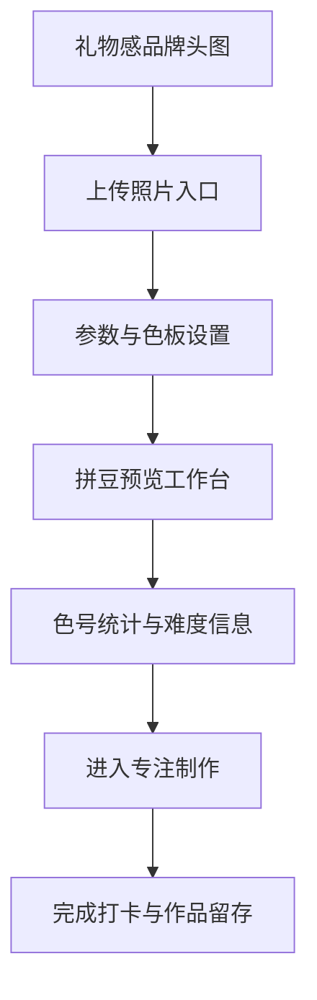

# 婷婷的拼豆工坊前端升级方案

## 1. 目标定位

把当前偏功能型的拼豆工具，升级成一个更像私人礼物站、也更像精品创作品牌站的产品。

目标气质：
- 温柔
- 高级
- 有陪伴感
- 像送给女朋友的专属网站
- 在视觉上统一，不再是功能块拼接感

当前代码里已经有一些好的方向，例如首页抬头区 [`HomeHeroHeader`](src/components/home/HomeHeroHeader.tsx:1) 已经开始往柔和渐变、玻璃感卡片走，首页主体 [`page.tsx`](src/app/page.tsx:1036) 也用了渐变背景。但整体仍然存在这些问题：

1. 全局设计语言不统一
   - [`globals.css`](src/app/globals.css:3) 只有极少的全局 token
   - 很多颜色直接写在组件类名里，导致粉、蓝、紫、灰并存，但没有明确主次
2. 功能感强，礼物感不够
   - 上传区、参数区、统计区、编辑区更像工具后台，而不是私人作品站
3. 卡片层级与间距系统不稳定
   - 有的模块是圆角 `rounded-xl`，有的是 `rounded-[2rem]`
   - 阴影、边框、透明度、模糊强度没有统一规范
4. 焦点模式与首页风格断层
   - [`src/app/focus/page.tsx`](src/app/focus/page.tsx:1) 还是更偏功能界面
5. 一些组件视觉语言偏旧
   - 例如 [`ColorPanel`](src/components/ColorPanel.tsx:47)、[`FloatingToolbar`](src/components/FloatingToolbar.tsx:33)、[`DownloadSettingsModal`](src/components/DownloadSettingsModal.tsx:56) 更像普通管理面板

---

## 2. 我建议的整体升级方向

我建议采用这个方向：

### 主题名
**奶油粉礼物系拼豆工作室**

### 关键词
- 粉白奶油
- 柔和玻璃拟态
- 手作礼物感
- 精致但不过度花哨
- 少女感里带一点品牌感

### 用户感受目标
用户打开网站，不是觉得“这是一个图片转拼豆的工具”，而是觉得：
- 这是婷婷专属的小站
- 这是做拼豆、存作品、完成打卡的地方
- 每一步都被温柔引导
- 做完作品像收到一张纪念卡

---

## 3. 视觉系统重做建议

### 3.1 设计 Token 先统一

先不要继续在各组件里零散写颜色，应该先建立全局设计 token，重点文件是 [`src/app/globals.css`](src/app/globals.css:1)。

建议新增一套语义化变量：
- 品牌主色：奶油粉
- 品牌辅色：蜜桃粉、香槟金、雾霾玫瑰
- 信息辅助色：雾蓝、鼠尾草绿
- 中性色：奶白、暖灰、可可灰
- 卡片层级：surface-1、surface-2、surface-glass
- 阴影层级：shadow-soft、shadow-card、shadow-float
- 圆角层级：radius-card、radius-pill、radius-panel

建议色板方向：
- 主色：`#F29CB6`
- 深主色：`#D97C98`
- 奶油底：`#FFF8F6`
- 柔白：`#FFFCFB`
- 杏粉：`#F8E1DA`
- 香槟金：`#E7CBA9`
- 雾蓝：`#AFC6D9`
- 鼠尾草绿：`#BFCDB3`
- 文字主色：`#5B4B52`
- 次级文字：`#8C7E84`
- 描边：`rgba(219, 196, 203, 0.55)`

这样后续首页、弹窗、底部面板、focus 模式都能统一。

### 3.2 字体与排版层级升级

当前 [`src/app/layout.tsx`](src/app/layout.tsx:7) 用的是 Geist，技术产品感偏强。它本身没问题，但如果目标是礼物感，可以这样处理：

- 保留 Geist 作为正文，确保可读性
- 新增一套更柔和的标题字体用于品牌标题或卡片标题
- 标题减少“工具感大字”，增加“品牌感标题”和“说明型副标题”

排版建议：
- H1 用于品牌感标题
- H2 用于模块标题
- 引导文案更口语、更陪伴式
- 操作文案从“功能说明”改成“陪你完成作品”的表达

例如：
- 当前：上传图片自动生成底稿
- 可升级为：把喜欢的照片变成一张可以慢慢完成的拼豆图纸

---

## 4. 首页结构升级建议

当前首页结构基本是：
- Hero
- 上传区
- 参数区
- 预览区
- 色号统计
- 手动模式与专注模式入口

结构是对的，但包装方式还不够高级。建议升级成下面这套内容编排：

### 4.1 Hero 区改成品牌首页头图

基于 [`HomeHeroHeader`](src/components/home/HomeHeroHeader.tsx:1) 继续升级，但不只是“好看标题”，而是做成真正品牌头图。

建议补充：
- 一句更有记忆点的主标题
- 一句更私人化的副标题
- 一个小的情绪标签区
- 一张示意拼豆卡片或作品展示卡
- 一个“开始制作”主按钮和“看看作品模式”次按钮

建议文案方向：
- 主标题：把喜欢，变成一颗一颗认真完成的拼豆作品
- 副标题：给婷婷的小站，用来做图纸、存灵感、记录每一次完成

视觉上：
- 背景做成奶油白到淡粉渐变
- 加低饱和漂浮圆点、珠粒、心形高光
- 右侧或下方加一个作品预览卡，增强品牌感

### 4.2 上传区从功能框升级成欢迎入口卡

当前上传区在 [`src/app/page.tsx`](src/app/page.tsx:1042) 是常规拖拽框。

建议升级为：
- 更像邀请卡片，而不是文件输入框
- 中间加入一张占位插画或相框式布局
- 明确 3 个步骤提示：上传照片、调整图纸、开始拼豆
- 增加“推荐图片类型”的温柔提示

可以把这块做成首页最核心入口卡，像一个礼物盒封面。

### 4.3 参数区升级成专业但温柔的控制台

[`HomeControlsPanel`](src/components/home/HomeControlsPanel.tsx:32) 现在已经拆出来了，但视觉仍然偏通用表单。

建议升级为：
- 改成分组卡片布局，不是简单两列输入框
- 每个设置项带说明文案
- 数字输入改成带微交互的 steppers 或 slider + input 组合
- 色板选择改成色卡 chips，而不是普通 select 感
- “应用数字”按钮改成更像主 CTA
- “自动抠图”做成柔和高亮的辅助动作

建议分成 3 组：
1. 图纸密度
2. 色板风格
3. 生成与修整

### 4.4 预览区升级成工作台核心舞台

当前预览卡片在 [`src/app/page.tsx`](src/app/page.tsx:1143) 已经有容器，但舞台感还不够。

建议升级为：
- 整体做成桌面工作台 card
- 预览上方增加状态条：图纸尺寸、色数、推荐难度
- 预览背景不要是普通灰底，改成柔和棋盘纹或奶油网格底
- 支持前后对比 tabs：原图 / 拼豆图 / 大图细节
- 让下载、进入手动编辑、进入专注模式形成一组明确操作层级

如果只做视觉升级，不改功能，也能显著提升专业度。

### 4.5 统计区从列表升级成作品信息卡

当前颜色统计区在 [`src/app/page.tsx`](src/app/page.tsx:1193) 更像技术列表。

建议改成：
- 顶部先显示总豆数、总颜色数、推荐板数
- 每个颜色项做成更精致的 chip row
- 支持按数量排序、按主色排序、按已排除折叠
- 排除颜色用更柔和的交互，不要大面积警示红
- 把“当前可用颜色过少”提示从警告框改成品牌语气的提示卡

这样不会破坏功能，但会让整个页面从“数据栏”变成“作品配方卡”。

---

## 5. 专注模式 Focus 的升级建议

[`src/app/focus/page.tsx`](src/app/focus/page.tsx:1) 是很有潜力的亮点，现在它像独立工具页，但其实可以把它做成最有记忆点的功能。

### 5.1 Focus 模式定位

把它从“施工界面”升级成：
**陪婷婷慢慢完成作品的专注工作台**

### 5.2 视觉方向
- 顶部采用沉浸式浅粉奶油背景，而不是普通灰背景
- 工具栏做得更精致轻薄
- 色板面板像手账贴纸抽屉
- 进度条更像作品完成度记录条
- 空状态和暂停状态更有陪伴感

### 5.3 核心体验优化

相关组件包括：
- [`ColorPanel`](src/components/ColorPanel.tsx:47)
- [`FloatingToolbar`](src/components/FloatingToolbar.tsx:33)
- [`CompletionCard`](src/components/CompletionCard.tsx:12)

建议：
1. [`FloatingToolbar`](src/components/FloatingToolbar.tsx:33)
   - 从纯功能圆按钮，升级成半透明珍珠感悬浮工具条
   - 使用统一图标、阴影、激活态
2. [`ColorPanel`](src/components/ColorPanel.tsx:47)
   - 从底部抽屉，升级成卡片式色板面板
   - 每个颜色项显示进度环、剩余颗数、名称标签
3. [`CompletionCard`](src/components/CompletionCard.tsx:12)
   - 这是最值得做高级感的地方
   - 做成“完成纪念卡”而不是普通弹窗
   - 可以加入完成日期、作品缩略图、耗时、总豆数、爱心文案
   - 下载时像一张可以分享的纪念海报

这部分会极大提升“送给女朋友的小站”的情绪价值。

---

## 6. 组件级统一改造建议

### 6.1 所有弹窗统一成一个视觉体系

当前像 [`DownloadSettingsModal`](src/components/DownloadSettingsModal.tsx:56) 这类弹窗，已经可用，但风格比较普通。

建议统一规范：
- 遮罩：柔和雾面 + 轻微模糊
- 容器：奶白玻璃卡片
- 标题：更柔和更精致
- 底部按钮：主次分明
- 开关、输入框、下拉框：统一边框、hover、focus 光晕

未来可以形成一套通用 Modal 样式基座。

### 6.2 按钮系统统一

目前按钮颜色较散，蓝色、紫色、粉色都在用。

建议统一为：
- 主按钮：奶油粉渐变
- 次按钮：白底描边
- 辅助按钮：透明底文字按钮
- 危险操作：低饱和莓果红

统一尺寸：
- 高度统一
- 圆角统一
- 阴影统一
- 悬浮反馈统一

### 6.3 卡片系统统一

建立三类卡片：
1. 品牌卡片
2. 功能卡片
3. 数据卡片

应用到：
- 首页 Hero
- 上传区
- 参数区
- 预览区
- 色号统计
- Focus 面板
- 下载弹窗
- 完成卡

这样全站才会像一个完整产品，而不是很多组件凑在一起。

---

## 7. 文案与情绪设计升级

这是这个项目能和普通工具站拉开差距的关键。

建议把文案从“工具提示语气”改成“温柔陪伴语气”。

例如：
- 小贴士：使用像素图进行转换前...
- 可改成：想让图纸更干净的话，尽量选择边缘清晰、主体明确的照片哦

例如按钮：
- 进入手动编辑模式
- 可改成：开始细修这张作品

例如专注模式：
- 进入专注模式
- 可改成：进入拼豆时刻

例如完成页：
- 完成打卡
- 可改成：这次也认真完成啦

这种变化不大，但非常符合你要的私人礼物感。

---

## 8. 我建议的实施优先级

### 第一阶段：先把气质统一
优先改：
- [`src/app/globals.css`](src/app/globals.css:1)
- [`src/app/layout.tsx`](src/app/layout.tsx:1)
- [`src/components/home/HomeHeroHeader.tsx`](src/components/home/HomeHeroHeader.tsx:1)
- [`src/components/home/HomeControlsPanel.tsx`](src/components/home/HomeControlsPanel.tsx:1)
- [`src/components/DownloadSettingsModal.tsx`](src/components/DownloadSettingsModal.tsx:1)

目标：先建立全站统一视觉语言。

### 第二阶段：把首页做成完整礼物站
优先改：
- [`src/app/page.tsx`](src/app/page.tsx:1036)
- 上传区、预览区、统计区、CTA 区

目标：让首页第一次打开就有惊艳感。

### 第三阶段：把 Focus 模式做成记忆点功能
优先改：
- [`src/app/focus/page.tsx`](src/app/focus/page.tsx:1)
- [`src/components/ColorPanel.tsx`](src/components/ColorPanel.tsx:1)
- [`src/components/FloatingToolbar.tsx`](src/components/FloatingToolbar.tsx:1)
- [`src/components/CompletionCard.tsx`](src/components/CompletionCard.tsx:1)

目标：让使用过程不仅专业，而且有陪伴感和完成仪式感。

---

## 9. 推荐的可执行 Todo

1. 建立全局设计 token 与统一卡片、按钮、表单样式
2. 重做首页 Hero 与上传入口，强化礼物感品牌头图
3. 重做参数面板与色板入口，形成专业但温柔的控制台
4. 升级预览区、数据摘要和色号统计，做成作品工作台
5. 统一弹窗与操作反馈样式，减少旧式面板感
6. 升级 Focus 模式视觉语言，统一与首页品牌风格
7. 重做完成卡与作品打卡体验，强化纪念感
8. 全站统一文案语气，改成更温柔、更私人化的表达

---

## 10. 我建议你优先选的方案

如果按我的审美，我建议直接走：

**方案 A：奶油粉礼物系品牌升级**

它最适合你的项目目标，因为它同时满足：
- 看起来更高级
- 看起来更好看
- 风格统一
- 很像专门送给女朋友的小站
- 又不会失去工具本身的专业感

如果后面进入实施，我建议先做这一版，不先分叉太多风格，先把主站做成统一的奶油粉礼物系品牌体验。